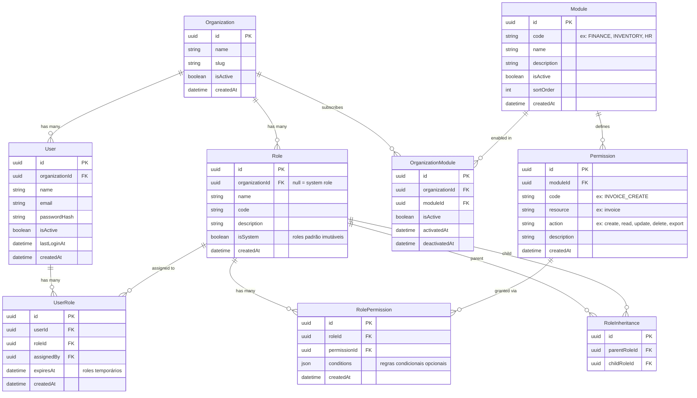
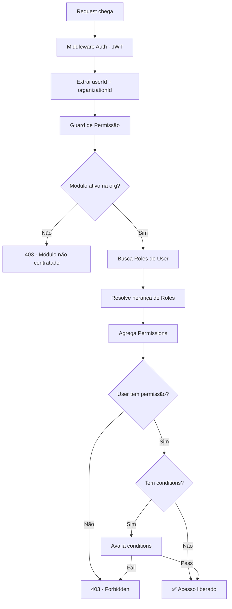

# 🏗️ Arquitetura RBAC Modular — ERP

## 1. Visão Geral da Arquitetura

O sistema RBAC segue o padrão **RBAC1 (Hierarchical RBAC)** com extensões para suporte modular e multi-tenancy.

### Princípios

- **Permissões são atômicas** — cada permissão representa uma ação sobre um recurso dentro de um módulo
- **Roles são composições** — um role agrupa permissões e pode herdar de outros roles
- **Módulos são isolados** — cada módulo registra suas próprias permissões no sistema
- **Multi-tenant nativo** — roles e atribuições são escopadas por organização/empresa

---

## 2. Diagrama de Relacionamento (ER)



---

## 3. Fluxo de Autorização



---

## 4. Schema Prisma

```prisma
// ============================================
// RBAC MODULE - ERP Modular
// ============================================

generator client {
  provider = "prisma-client-js"
}

datasource db {
  provider = "postgresql"
  url      = env("DATABASE_URL")
}

// ── Organization (Tenant) ──────────────────

model Organization {
  id        String   @id @default(uuid()) @db.Uuid
  name      String
  slug      String   @unique
  document  String?  @unique // CNPJ
  isActive  Boolean  @default(true)
  createdAt DateTime @default(now())
  updatedAt DateTime @updatedAt

  users   User[]
  roles   Role[]
  modules OrganizationModule[]

  @@map("organizations")
}

// ── User ───────────────────────────────────

model User {
  id             String    @id @default(uuid()) @db.Uuid
  organizationId String    @db.Uuid
  name           String
  email          String
  passwordHash   String
  isActive       Boolean   @default(true)
  lastLoginAt    DateTime?
  createdAt      DateTime  @default(now())
  updatedAt      DateTime  @updatedAt

  organization Organization @relation(fields: [organizationId], references: [id])
  roles        UserRole[]   @relation("UserRoles")
  assignedRoles UserRole[]  @relation("AssignedByUser")

  @@unique([organizationId, email])
  @@index([organizationId])
  @@map("users")
}

// ── Module ─────────────────────────────────

model Module {
  id          String   @id @default(uuid()) @db.Uuid
  code        String   @unique // FINANCE, INVENTORY, HR, SALES, etc.
  name        String
  description String?
  icon        String?  // ícone para UI
  isActive    Boolean  @default(true)
  sortOrder   Int      @default(0)
  createdAt   DateTime @default(now())
  updatedAt   DateTime @updatedAt

  permissions   Permission[]
  organizations OrganizationModule[]

  @@map("modules")
}

// ── Organization <-> Module (Subscription) ─

model OrganizationModule {
  id             String    @id @default(uuid()) @db.Uuid
  organizationId String    @db.Uuid
  moduleId       String    @db.Uuid
  isActive       Boolean   @default(true)
  activatedAt    DateTime  @default(now())
  deactivatedAt  DateTime?

  organization Organization @relation(fields: [organizationId], references: [id])
  module       Module       @relation(fields: [moduleId], references: [id])

  @@unique([organizationId, moduleId])
  @@map("organization_modules")
}

// ── Permission ─────────────────────────────

model Permission {
  id          String   @id @default(uuid()) @db.Uuid
  moduleId    String   @db.Uuid
  code        String   @unique // MODULE_RESOURCE_ACTION: FINANCE_INVOICE_CREATE
  resource    String   // invoice, payment, product, employee
  action      String   // create, read, update, delete, export, approve
  description String?
  createdAt   DateTime @default(now())

  module Module           @relation(fields: [moduleId], references: [id])
  roles  RolePermission[]

  @@index([moduleId])
  @@index([resource, action])
  @@map("permissions")
}

// ── Role ───────────────────────────────────

model Role {
  id             String  @id @default(uuid()) @db.Uuid
  organizationId String? @db.Uuid // null = system-wide role
  name           String
  code           String
  description    String?
  isSystem       Boolean @default(false) // protege contra edição
  createdAt      DateTime @default(now())
  updatedAt      DateTime @updatedAt

  organization Organization?    @relation(fields: [organizationId], references: [id])
  permissions  RolePermission[]
  users        UserRole[]

  // Herança hierárquica
  parentOf RoleInheritance[] @relation("ParentRole")
  childOf  RoleInheritance[] @relation("ChildRole")

  @@unique([organizationId, code])
  @@index([organizationId])
  @@map("roles")
}

// ── Role <-> Permission ────────────────────

model RolePermission {
  id           String   @id @default(uuid()) @db.Uuid
  roleId       String   @db.Uuid
  permissionId String   @db.Uuid
  conditions   Json?    // {"ownOnly": true} ou {"maxAmount": 10000}
  createdAt    DateTime @default(now())

  role       Role       @relation(fields: [roleId], references: [id], onDelete: Cascade)
  permission Permission @relation(fields: [permissionId], references: [id], onDelete: Cascade)

  @@unique([roleId, permissionId])
  @@map("role_permissions")
}

// ── User <-> Role ──────────────────────────

model UserRole {
  id         String    @id @default(uuid()) @db.Uuid
  userId     String    @db.Uuid
  roleId     String    @db.Uuid
  assignedBy String?   @db.Uuid
  expiresAt  DateTime? // para roles temporários
  createdAt  DateTime  @default(now())

  user       User @relation("UserRoles", fields: [userId], references: [id], onDelete: Cascade)
  role       Role @relation(fields: [roleId], references: [id], onDelete: Cascade)
  assignedByUser User? @relation("AssignedByUser", fields: [assignedBy], references: [id])

  @@unique([userId, roleId])
  @@index([userId])
  @@map("user_roles")
}

// ── Role Inheritance (Hierarquia) ──────────

model RoleInheritance {
  id            String @id @default(uuid()) @db.Uuid
  parentRoleId  String @db.Uuid
  childRoleId   String @db.Uuid

  parent Role @relation("ParentRole", fields: [parentRoleId], references: [id], onDelete: Cascade)
  child  Role @relation("ChildRole", fields: [childRoleId], references: [id], onDelete: Cascade)

  @@unique([parentRoleId, childRoleId])
  @@map("role_inheritances")
}
```

---

## 5. Convenção de Nomenclatura de Permissões

Padrão: `MODULE_RESOURCE_ACTION`

| Módulo | Permissão | Descrição |
|--------|-----------|-----------|
| FINANCE | `FINANCE_INVOICE_CREATE` | Criar faturas |
| FINANCE | `FINANCE_INVOICE_READ` | Visualizar faturas |
| FINANCE | `FINANCE_INVOICE_APPROVE` | Aprovar faturas |
| FINANCE | `FINANCE_PAYMENT_CREATE` | Registrar pagamentos |
| INVENTORY | `INVENTORY_PRODUCT_CREATE` | Cadastrar produto |
| INVENTORY | `INVENTORY_STOCK_ADJUST` | Ajustar estoque |
| HR | `HR_EMPLOYEE_READ` | Visualizar funcionários |
| HR | `HR_PAYROLL_APPROVE` | Aprovar folha |
| SALES | `SALES_ORDER_CREATE` | Criar pedido de venda |
| SALES | `SALES_ORDER_CANCEL` | Cancelar pedido |

---

## 6. Roles de Sistema (Seeds)

```
SUPER_ADMIN     → Todas as permissões (bypass)
ORG_ADMIN       → Todas as permissões da organização
MODULE_MANAGER  → Gerencia um módulo específico
VIEWER          → Read-only em módulos habilitados
```

Cada organização pode criar **roles customizados** além dos de sistema.

---

## 7. Conditional Permissions (Avançado)

O campo `conditions` em `RolePermission` permite regras granulares:

```json
// Só pode ver/editar registros próprios
{ "ownOnly": true }

// Limite de valor para aprovação
{ "maxAmount": 10000 }

// Restrição por filial
{ "branchIds": ["uuid-1", "uuid-2"] }

// Restrição por horário
{ "allowedHours": { "start": "08:00", "end": "18:00" } }
```

---

## 8. Como um Módulo se Registra

Quando um novo módulo é adicionado ao ERP, ele executa um **seed de permissões**:

```typescript
// modules/finance/finance.permissions.ts
export const FINANCE_PERMISSIONS = [
  { resource: 'invoice',  actions: ['create', 'read', 'update', 'delete', 'approve', 'export'] },
  { resource: 'payment',  actions: ['create', 'read', 'update', 'delete', 'approve'] },
  { resource: 'account',  actions: ['create', 'read', 'update', 'delete'] },
  { resource: 'report',   actions: ['read', 'export'] },
];

// O módulo registra suas permissões no boot:
async function registerModulePermissions(moduleCode: string, permissions: ModulePermission[]) {
  const module = await prisma.module.findUnique({ where: { code: moduleCode } });

  for (const perm of permissions) {
    for (const action of perm.actions) {
      const code = `${moduleCode}_${perm.resource.toUpperCase()}_${action.toUpperCase()}`;
      await prisma.permission.upsert({
        where: { code },
        create: {
          moduleId: module.id,
          code,
          resource: perm.resource,
          action,
          description: `${action} ${perm.resource} in ${moduleCode}`,
        },
        update: {},
      });
    }
  }
}
```

---

## 9. Decorator de Autorização (NestJS)

```typescript
// Uso no controller:
@RequirePermission('FINANCE_INVOICE_CREATE')
@Post('invoices')
async createInvoice(@Body() dto: CreateInvoiceDto) { ... }

// Ou verificação por módulo:
@RequireModule('FINANCE')
@RequirePermission('FINANCE_INVOICE_READ')
@Get('invoices')
async listInvoices() { ... }
```

---

## 10. Próximos Módulos (Roadmap)

Cada módulo seguirá o mesmo padrão de registro:

| Módulo | Code | Recursos Principais |
|--------|------|-------------------|
| Financeiro | `FINANCE` | Faturas, Pagamentos, Contas, DRE |
| Estoque | `INVENTORY` | Produtos, Movimentações, Inventário |
| Vendas | `SALES` | Pedidos, Orçamentos, Comissões |
| Compras | `PURCHASE` | Pedidos de Compra, Fornecedores |
| RH | `HR` | Funcionários, Folha, Ponto |
| Fiscal | `FISCAL` | NF-e, NFS-e, SPED |
| CRM | `CRM` | Leads, Oportunidades, Pipeline |
| Reservas | `BOOKING` | Reservas, Disponibilidade, Check-in |
